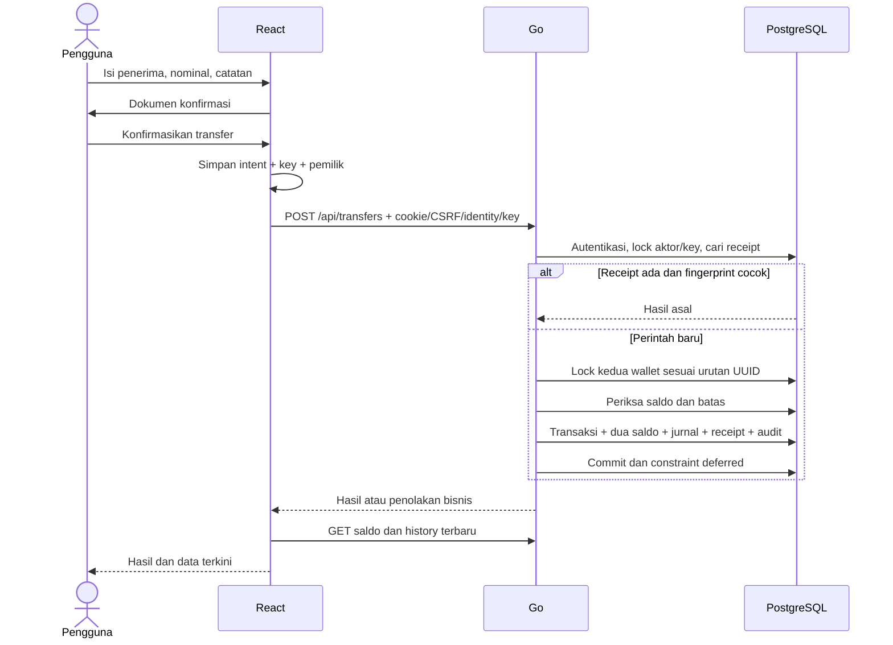
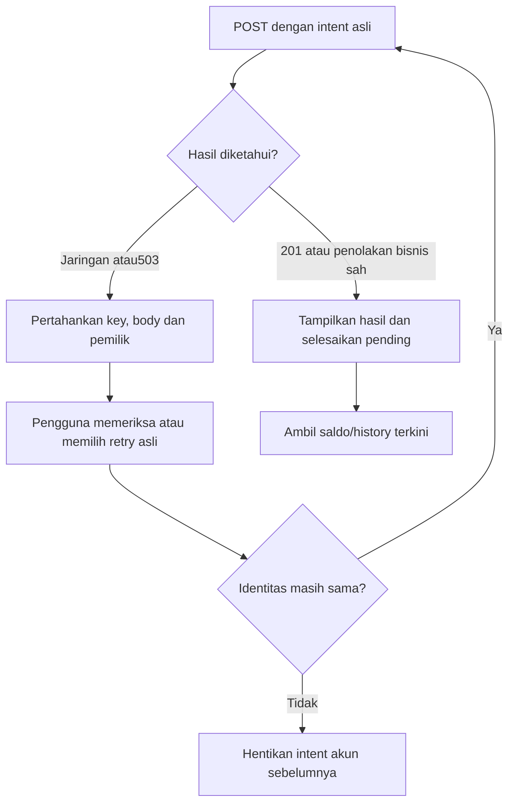
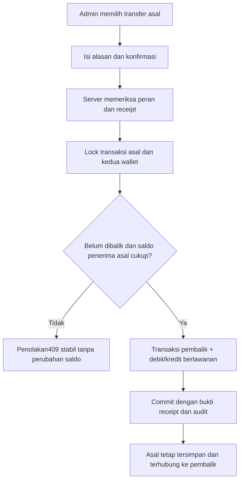

# Alur aplikasi

## Transfer

```mermaid
sequenceDiagram
    actor Pengguna
    participant UI as React
    participant API as Go
    participant DB as PostgreSQL
    Pengguna->>UI: Isi penerima, nominal, catatan
    UI->>Pengguna: Dokumen konfirmasi
    Pengguna->>UI: Konfirmasikan transfer
    UI->>UI: Simpan intent + key + pemilik
    UI->>API: POST /api/transfers + cookie/CSRF/identity/key
    API->>DB: Autentikasi, lock aktor/key, cari receipt
    alt Receipt ada dan fingerprint cocok
        DB-->>API: Hasil asal
    else Perintah baru
        API->>DB: Lock kedua wallet sesuai urutan UUID
        API->>DB: Periksa saldo dan batas
        API->>DB: Transaksi + dua saldo + jurnal + receipt + audit
        API->>DB: Commit dan constraint deferred
    end
    API-->>UI: Hasil atau penolakan bisnis
    UI->>API: GET saldo dan history terbaru
    UI-->>Pengguna: Hasil dan data terkini
```

## Respons hilang

```mermaid
flowchart TD
    A[POST dengan intent asli] --> B{Hasil diketahui?}
    B -->|201 atau penolakan bisnis sah| C[Tampilkan hasil dan selesaikan pending]
    B -->|Jaringan atau503| D[Pertahankan key, body dan pemilik]
    D --> E[Pengguna memeriksa atau memilih retry asli]
    E --> F{Identitas masih sama?}
    F -->|Ya| A
    F -->|Tidak| G[Hentikan intent akun sebelumnya]
    C --> H[Ambil saldo/history terkini]
```

## Pembalikan

```mermaid
flowchart TD
    A[Admin memilih transfer asal] --> B[Isi alasan dan konfirmasi]
    B --> C[Server memeriksa peran dan receipt]
    C --> D[Lock transaksi asal dan kedua wallet]
    D --> E{Belum dibalik dan saldo penerima asal cukup?}
    E -->|Tidak| F[Penolakan409 stabil tanpa perubahan saldo]
    E -->|Ya| G[Transaksi pembalik + debit/kredit berlawanan]
    G --> H[Commit dengan bukti receipt dan audit]
    H --> I[Asal tetap tersimpan dan terhubung ke pembalik]
```
